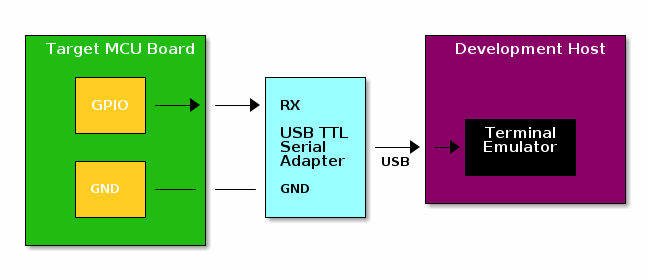

# BBSerialTx: Bit-Banged Serial Transmitter

This module implements a bit-banged serial transmitter over a GPIO line
using the *8N1 protocol* (8-bit data, No parity, 1 stop bit, see
https://en.wikipedia.org/wiki/8-N-1), emulating a *UART transmitter* (see
https://en.wikipedia.org/wiki/Universal_asynchronous_receiver-transmitter).
This is suitable for connecting an MCU to a UART receiver for logging or other
unidirectional communications.

BBSerialTx uses no external functions, timers, interrupts, DMA, UART's, or
other MCU peripherals or resources, so it imposes minimal demands on the MCU or
runtime context. As soon as you can bring up a single GPIO in any context, you
can get serial output.

The only resource consumed is CPU time. This can affect timing-critical
operations, so be sure the system can tolerate the delay imposed by
outputting data. This can create Heisenbugs: the act of observing the system
perturbs it.

The hardware connection is a two-wire connection: TX (the GPIO line) to RX,
and GND to GND. A typical application is to connect to a USB-TTL serial adapter
that connects to your development host, for logging to a terminal emulator:

Note: GPIO is TTL-level, not RS-232 level, so the receiver must be a TTL UART device. RS-232 uses a different voltage range with inverted logic. If you need to output to an RS-232 device, you'll need a TTL/RS-232 converter between the devices. The converter may also need to be configured as a null modem.

# Documentation

The **documents** directory contains the documentation, generated with Doxygen from the **source** directory and **mainpage.md**. It includes the following sections:

- **Usage:** How to use BBSerialTx on a target MCU.
- **Hardware Connection:** How to connect the MCU to an external device.
- **Theory Of Operation:** How BBSerialTx works, implementing the 8N1 serial communications protocol.
- **Arduino Example:** A simple example using BBSerialTx on an Arduino-compatible board.
- **Build and Test:** Instructions for building and testing the Google Test suite locally for off-target testing.
- **Analysis:** Source code and test coverage analysis.
- **Tools:** The tools used to work on this (on Ubuntu 20.04).

# Repo Contents

- **README.md:** This readme.
- **LICENSE:** MIT license file.
- **CMakeLists.txt:** CMake file for building locally (not target cross-build) and generating documentation.
- **mainpage.md** Documentation main page file for Doxygen.
- **source:** BBSerialTx source directory.
- **test:** Google Test source directory for local off-target testing.
- **analysis:** Analysis of BBSerialTx source code and Google Test suite test coverage.
- **documents:** Documentation generated with Doxygen.
- **scripts:** Helper scripts directory.
